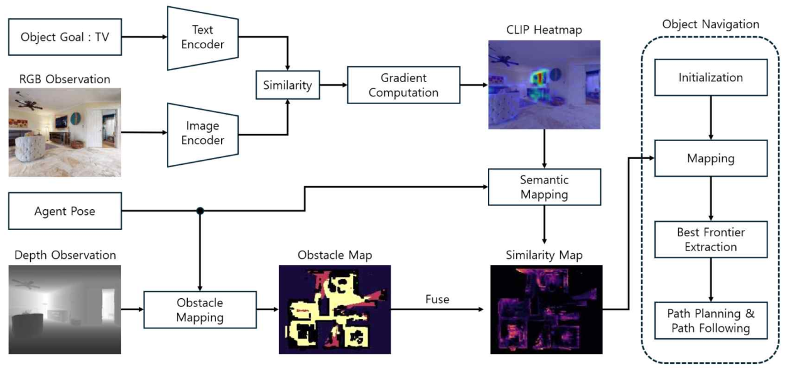
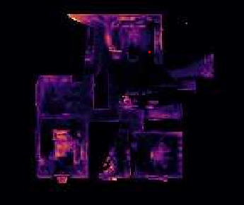

# Explainable, Memory-Efficient Zero-Shot Object Navigation

This repository contains the research prototype presented at CICS 2025 on explainable, memory-efficient Zero-Shot Object Navigation (ZSON). The goal of this work is to enable a mobile robot to find a target object (e.g. "find a chair") in an unseen environment without any task-specific fine-tuning.

  

  <em>Figure 1. High-level navigation pipeline. A language-conditioned visual encoder produces a goal-relevant response map, which drives semantic frontier exploration.</em>

## Motivation

Traditional object navigation systems often rely on large vision-language or segmentation models that:
- consume significant GPU VRAM,
- require dense semantic maps with fixed resolution,
- and do not provide interpretable reasoning about <em>why</em> the robot is moving toward a certain location.

This makes real-time deployment on lightweight robots difficult.

Our work focuses on addressing all three issues: **zero-shot generalization, memory efficiency, and explainability.**

## Core Idea

1. We generate a semantic response map (similarity heatmap) of the target text query (e.g. "chair") over the robot’s visual observations using a CLIP-like vision-language model.
2. Instead of storing a dense, fixed-resolution global semantic map, we keep a compact map that highlights only the regions that are semantically important for the current goal.
3. We guide exploration using a <em>semantic frontier policy</em>:  
   - The robot prefers unexplored regions that are not just geometrically reachable, but also semantically promising (high response to the goal object).  
   - In other words, we don’t explore “everywhere.” We explore “where it actually looks like the target might be.”

This allows the robot to move intelligently toward likely object locations while keeping GPU and memory usage low.

  

  <em>Figure 2. Example of a goal-conditioned similarity / semantic response map. Brighter regions indicate higher confidence that the target object is present.</em>

## Explainability

A key property of this approach is that the navigation decision is visually interpretable:
- The model produces a heatmap that shows <em>why</em> the robot believes the target object might be in a certain direction.
- That heatmap directly influences frontier selection.
- Because the decision comes from gradient-based relevance of the vision-language encoder (rather than an opaque black-box policy network), we can trace back which visual evidence led to a movement choice.

In short, the robot can say “I am going this way because this region looks like a <strong>chair</strong>.”

## Zero-Shot Ability

The system does not depend on object-specific detectors or task-specific training for each category.  
New instructions such as “Find the fire extinguisher” or “Go to the refrigerator” can be processed at run-time, as long as the vision-language encoder can understand the text description.

This avoids retraining for every new object class and is suitable for real-world open-vocabulary navigation.

## Memory Efficiency

Instead of building a full dense semantic map at uniform resolution, we:
- store high-resolution information only where it matters semantically,
- keep low-resolution / compressed representation elsewhere,
- and update the map incrementally as the robot explores.

This adaptive representation reduces VRAM and overall map size while preserving useful semantics for navigation.

In internal experiments, this approach significantly reduced map memory footprint while maintaining navigation performance (success rate and SPL), compared to naive dense semantic mapping strategies.

## Highlights

- **Explainable navigation**: action decisions can be visualized as heatmaps.
- **Zero-shot**: handles unseen categories without retraining.
- **Semantic frontier exploration**: goes to “likely target areas,” not just any unexplored frontier.
- **Low memory / low VRAM**: designed to run on resource-constrained robots.

## (Planned) Media

We plan to include:
- Qualitative navigation examples (robot camera view + semantic heatmap overlay).
- Map visualization showing how semantic frontiers are selected.
- Memory usage comparison (e.g. X GB → Y GB).

We will update this section with figures.

## Citation

If you use or reference this work, please cite:

> [Conference/Workshop Submission]  
> "Explainable, Memory-Efficient Zero-Shot Object Navigation for Resource-Constrained Robots", CICS 2025.

(TBA: we will update with final citation / BibTeX once available.)

---

## Project Status

This repository currently focuses on research concepts and visualization of the navigation pipeline.  
Code will continue to be modularized and cleaned for public release.

**Note:** Some dataset paths, robot drivers, and environment-specific launch files are not included here due to hardware dependency.

---

## Acknowledgments

Parts of this repository are inspired by and build upon:
- [OneMap (KTH-RPL)](https://github.com/KTH-RPL/OneMap) for map representation and spatial organization.
- [Grad-ECLIP](https://github.com/Cyang-Zhao/Grad-Eclip) for gradient-based, CLIP-style semantic relevance mapping.

---

## License

TBD.
